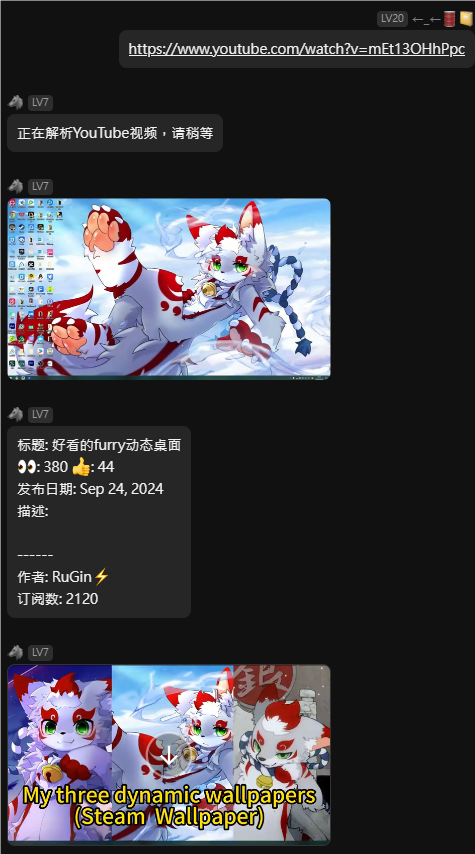
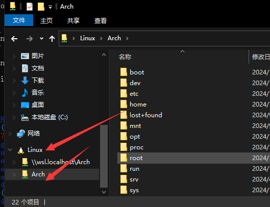
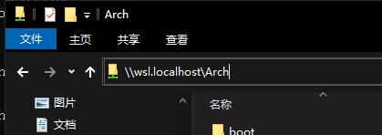

# yunzai-yt-dl-plugin

🚀 **yunzai-yt-dl-plugin** 是一款为 Yunzai-Bot（云崽）打造的 YouTube 视频下载插件。  
它可以自动识别消息中的 YouTube 链接，下载并发送对应的视频，并支持输出视频相关信息。  
如果你使用Nonebot而不是云崽，看这里：[Nonebot版本](https://github.com/GangFaDeShenMe/nonebot_plugin_yt_dl)
## 示例：
  
比较抽象的URL也可以正常识别：  


---

## 📦 安装步骤

### 1. 安装插件

在你的 `Yunzai-Bot` 插件根目录下运行以下命令：

```bash
cd ./plugins
git clone https://github.com/GangFaDeShenMe/yunzai-yt-dl-plugin.git
cd yunzai-yt-dl-plugin
```

### 2. 安装依赖

```bash
pnpm install
```
或者
```bash
npm install
```

### 3. 代理设置（墙内服务器必需）

如果你的服务器位于墙内，你有两个选择：

1. 使用插件内置的HTTP代理功能：
   ```
   #ytdl代理http://你的代理ip:端口
   ```

2. 使用透明代理：
   - Linux用户：参考 [proxychains 配置指南](proxychains.md)
   - Windows用户：可以使用 Netch 等工具

---

## 🛠️ 使用方法

### 1. 基本命令

- **下载视频**：直接发送YouTube视频链接即可。支持所有常见的链接格式。示例：
   - `https://www.youtube.com/watch?v=dQw4w9WgXcQ`
   - `youtube.com/watch?v=dQw4w9WgXcQ`
   - `youtu.be/dQw4w9WgXcQ`
   - `youtube.com/shorts/GDrAVEIysak`
- **设置代理**：`#ytdl代理[HTTP代理地址]`
- **设置超时**：`#ytdl超时[秒数]`
- **WSL路径设置**：`#ytdlwsl[WSL路径]`
- **用户管理**：
   - 拉黑用户：`#ytdl拉黑[QQ号]`
   - 取消拉黑：`#ytdl取消拉黑[QQ号]`
   - 查看拉黑列表：`#ytdl拉黑`

### 2. WSL 支持

如果你在 WSL 环境下运行 Yunzai-Bot，而 QQ 客户端在 Windows 下，需要设置 WSL 路径，才能正常发送文件：

1. 打开资源管理器，找到如图的路径：  
  
  
2. 复制路径，例如：`\\wsl.localhost\Ubuntu`
3. 在机器人中设置：
   ```
   #ytdlwsl\\wsl.localhost\Arch
   ```

---

## ❗ 常见问题

1. `UnrecoverableError: Sign in to confirm you're not a bot`
   - 解决方案：更换干净的代理节点。~~比如 [ShadowFurry](https://shadowfurry.com)~~

2. `文件路径必须为绝对路径`等问题
   - 解决方案：如果涉及 WSL 分离部署，需要正确设置 WSL 路径（见上文）

3. 下载失败或超时
   - 检查代理设置是否正确
   - 尝试增加超时时间：`#ytdl超时600`

---

## 🔍 TODO & 未来计划

- [ ] **自定义视频格式和分辨率**：支持更多视频格式和分辨率的选择。
- [ ] **提供登录支持**：拯救被 YT 拉清单的 IP。  

**PRs are welcome!**

---

## ⚠️ 免责声明

- 使用时请遵守各国法律，禁止用于传播任何形式的违法内容。
- 使用本插件下载视频时，请遵守 YouTube 相关服务协议及版权规定。
- 本插件仅用于学习交流，插件开发者不对用户的任何非法使用行为负责。

---

## 📝 其他

如果你有任何问题、建议或改进意见，欢迎通过 GitHub Issues 进行反馈！

📧 **联系方式**：你可以通过 [GitHub Issues](https://github.com/GangFaDeShenMe/yunzai-yt-dl-plugin/issues) 提交问题和建议。
